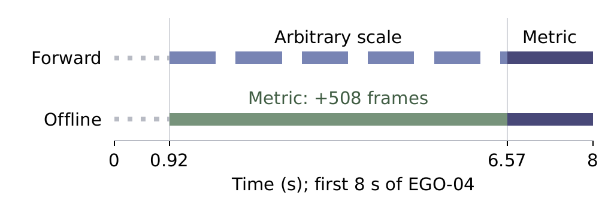

<div align="center">

# MonoTag SLAM
**Marker-aided monocular metric reconstruction**

<a href="https://anyverse.com/"></a>

[Capture system & hardware](https://github.com/jiejie567/MonoEgo) · [Installation](docs/INSTALL.md) · [Reproducibility](REPRODUCIBILITY.md)

</div>

English | [中文](README_CN.md)

MonoTag combines natural image features with known-size square markers to reconstruct metric camera motion from one RGB camera. Built on ORB-SLAM3, it uses marker corners in geometric optimization, revisits earlier frames offline, and maintains an Atlas across multiple maps.

The repository retains the name **EgoMono** for link compatibility. **MonoTag SLAM** is the backend; **MonoEgo** is the complete capture system. This is a prepared source release, currently private.

## Method at a glance

- **Marker-first initialization:** reliable fixed markers seed metric camera poses before background features have sufficient triangulation parallax.
- **Metric re-anchoring:** new marker observations constrain scale along the connected visual trajectory, with geometric checks before committing updates.
- **Map recovery and merging:** visual and common-anchor evidence propose loop closures or map merges. A matching ID alone is not unconditional permission to merge.
- **Offline retrospective recovery:** verified image-to-map correspondences can recover earlier and short-gap poses. This is not interpolation or a guarantee of frame-zero recovery.
- **Separate marker roles:** workstation markers constrain the static map; calibrated wrist markers belong to moving fixtures.

<p align="center"></p>

## What's included

| Path | Contents |
|---|---|
| `third_party/ORB_SLAM3/` | Modified C++ backend and native regressions |
| `aruco_track/` | Python observation, wrist geometry, replay and export |
| `process_monotag.py` | Hash-bound Ubuntu processing entry |
| `config/monotag_ubuntu_profile.json` | Validated feature profile |
| `scripts/` | Build, runtime setup, evaluation and diagnostics |
| `tests/` | Release tests and historical experimental tests |
| `export_lerobot_dataset.py` | Optional validity-aware training export |

Recordings, binaries, model weights, vocabulary, device-specific camera calibration and generated caches are excluded. Diagnostic scripts do not define alternative production defaults.

## Installation

Ubuntu 24.04 is the validated reconstruction platform. Follow the [installation guide](docs/INSTALL.md) to provision OpenCV/Pangolin and vocabulary before building:

```bash
git clone https://github.com/jiejie567/EgoMono.git
cd EgoMono
make setup
make native DEPS_PREFIX=/path/to/dependencies
.venv/bin/python scripts/init_runtime.py \
  --deps-prefix /path/to/dependencies --vocabulary /path/to/ORBvoc.txt
```

Hand networks are optional and separately licensed. SLAM-only processing needs neither a GPU nor hand-model weights.

## Quick start

```bash
.venv/bin/python process_monotag.py input.mp4 \
  --calib camera.json --head-slam --slam-init auto --auto-marker-map \
  --static-marker-ids 20-49 --static-marker-size-mm 48 \
  --no-hand-joints --slam-replay --save-atlas runs/demo/atlas.osa \
  --output runs/demo/actions.jsonl

.venv/bin/python render_slam_replay.py runs/demo/actions.jsonl --hybrid
```

Use your actual marker IDs, measured black-square dimensions and calibrated intrinsics. These values are examples. Each run requires a fresh output location.

## Outputs and validity

Outputs distinguish localization, metric scale, map identity and revision. World-frame wrist output requires a supported camera pose, a metric frame and an accepted fixture observation. Unsupported intervals remain invalid; display interpolation is not a measurement.

Replay separates final offline reconstruction from the recorded mapping process. Hardware, example videos and compact result tables are in [MonoEgo](https://github.com/jiejie567/MonoEgo).

## Tests and reproducibility

```bash
make smoke
make native-smoke DEPS_PREFIX=/path/to/dependencies
```

[Reproducibility notes](REPRODUCIBILITY.md) identify the frozen runtime and release test boundary. Rebuilds do not imply bitwise-identical trajectories. Odin odometry is an external camera reference, not estimator input or independently certified ground truth. Static wrist scatter measures precision, not dynamic anatomical accuracy.

## Acknowledgements and license

MonoTag extends [ORB-SLAM3](https://github.com/UZ-SLAMLab/ORB_SLAM3), with OpenCV, Eigen, Pangolin and its included third-party libraries.

Code uses [GPL-3.0](LICENSE); third-party notices remain intact. Original project documentation is additionally licensed under [CC BY 4.0](docs/ASSET_LICENSE.md). The company logo is excluded; no trademark rights are granted. Learned models and datasets retain their own terms.
